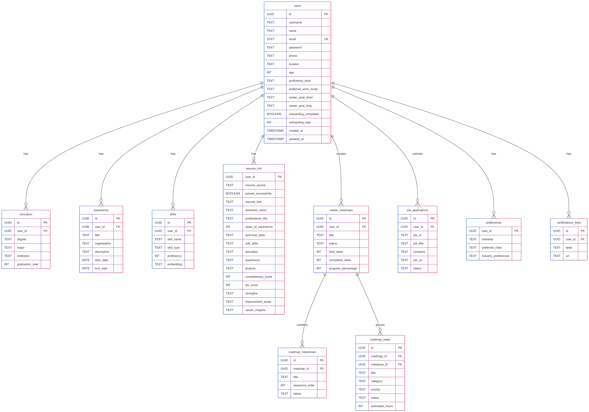
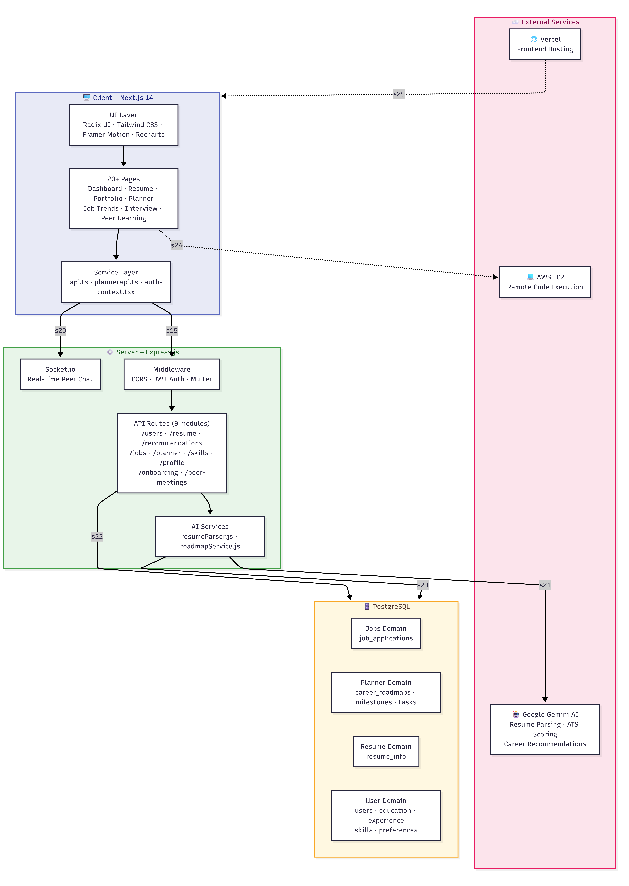

# NitiAI - Comprehensive AI Career Guidance Platform 🚀

NitiAI is an all-in-one intelligent career acceleration platform. It helps users analyze resumes, gain market insights, generate professional portfolios, and practice with a state-of-the-art Mock Interview Arena.

## 🔗 Deployment
The live application is accessible at: **[https://nitiai.vercel.app](https://nitiai.vercel.app)**

---

## 🌟 Key Features

### 1. NitiAI Core (Career Guidance)
*   **📄 AI Resume Parsing**: Extracts skills, experience, and education from PDFs using Google Gemini.
*   **🎭 Career Persona**: Deep analysis of your professional profile to highlight unique value propositions.
*   **🤖 AI Career Coach**: Personalized career advice and skill gap analysis via an interactive chat interface.
*   **💼 Job Tracker**: Save jobs from LinkedIn and get instant AI-match scores.
*   **📈 Market Trends**: Visualizes trending roles, growing industries, and salary insights.
*   **🌐 Portfolio Builder**: Generates stunning, downloadable personal portfolios.

### 2. Mock Interview Arena
*   **💻 Coding Environment**: Real-time collaborative editor with live code execution.
*   **🎙️ Voice Interactor**: AI-powered voice interviews for a hands-free, realistic experience (powered by Vapi).
*   **📊 Performance Reports**: Detailed post-interview feedback on code quality, logic, and communication.
*   **🔍 Resource Discovery**: Targeted YouTube resources based on your interview performance.

---

## 🏗️ System Architecture & Database Design

### 1. System Architecture Pipeline


### 2. Database Schema Design


---

## 🔑 Master API Key Guide

To fully power NitiAI, you must configure the following API keys in their respective `.env` files.

| API Key | Purpose | Required In |
| :--- | :--- | :--- |
| `GEMINI_API_KEY` | Resume parsing, Career feedback, & Interview evaluation | `server/.env` & `MOCK_INTERVIEW/backend/.env` |
| `OPENROUTER_API_KEY` | Advanced LLM analysis & fallback reasoning | `server/.env` & `MOCK_INTERVIEW/backend/.env` |
| `RAPIDAPI_KEY` | LinkedIn job search data | `server/.env` |
| `ADZUNA_APP_ID/KEY` | Job market trends and salary data | `server/.env` |
| `EXECUTION_API_URL` | Safe remote code execution (Piston/GCP) | `MOCK_INTERVIEW/backend/.env` |
| `SERPAPI_API_KEY` | Targeted YouTube educational resource search | `MOCK_INTERVIEW/backend/.env` |
| `NEXT_PUBLIC_VAPI_KEY` | Voice-based AI interview interaction | `MOCK_INTERVIEW/frontend/.env.local` |
| `DATABASE_URL` | PostgreSQL connection string | `server/.env` |
| `JWT_SECRET` | Secure authentication and token signing | `server/.env` |

---

## 🚀 Getting Started

### Project Structure
- `/client` & `/server`: The core NitiAI Career Guidance platform.
- `/MOCK_INTERVIEW/frontend` & `/MOCK_INTERVIEW/backend`: The dedicated Interview Arena.

### 1. Setup NitiAI Core
**Backend (`/server`):**
```bash
cd server && npm install
# Setup .env with GEMINI, RAPIDAPI, ADZUNA, DATABASE_URL
npm run dev
```

**Frontend (`/client`):**
```bash
cd client && npm install
# Setup .env with NEXT_PUBLIC_API_URL
npm run dev
```

### 2. Setup Mock Interview Arena
**Backend (`/MOCK_INTERVIEW/backend`):**
```bash
cd MOCK_INTERVIEW/backend && npm install
# Setup .env with GEMINI, OPENROUTER, SERPAPI, EXECUTION_API_URL
npm start
```

**Frontend (`/MOCK_INTERVIEW/frontend`):**
```bash
cd MOCK_INTERVIEW/frontend && npm install
# Setup .env.local with VAPI, OPENROUTER, SERPAPI
npm run dev
```

---

## 🛠️ Tech Stack
- **Frontend**: Next.js 14, Tailwind CSS, Framer Motion, Socket.io, Lucide React.
- **Backend**: Node.js, Express, PostgreSQL, Socket.io, JWT.
- **AI/Cloud**: Google Gemini, OpenRouter, Vapi AI, GCP Compute Engine.

---
Developed with ❤️ for NitiAI
